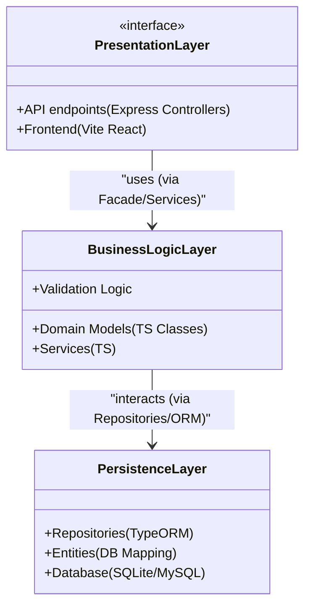
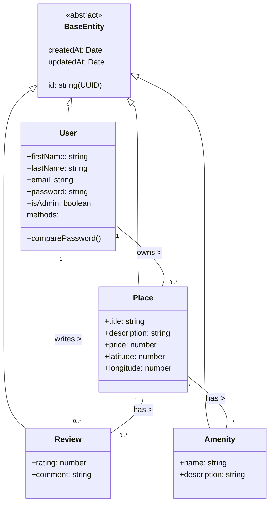
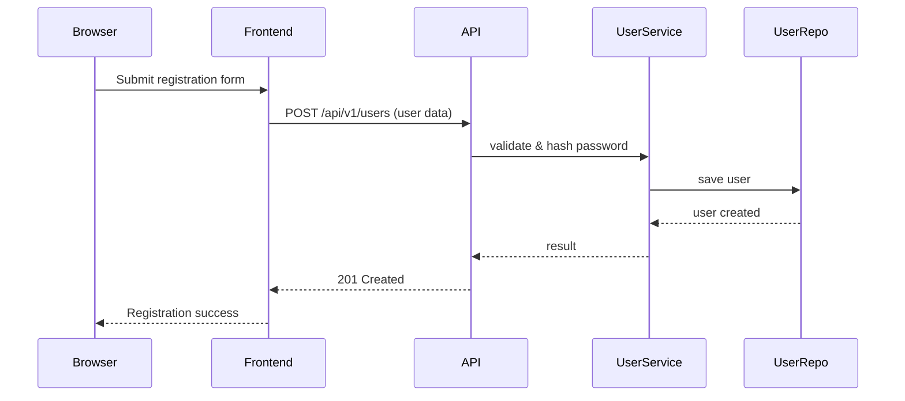
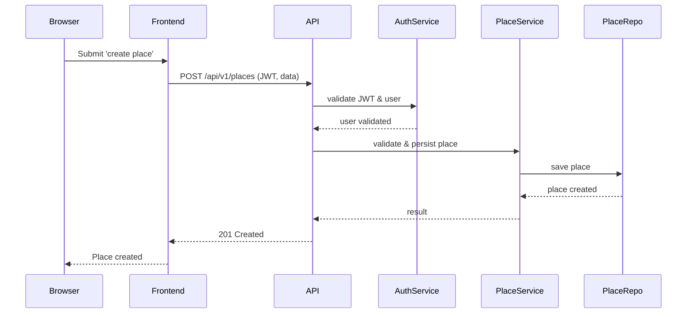
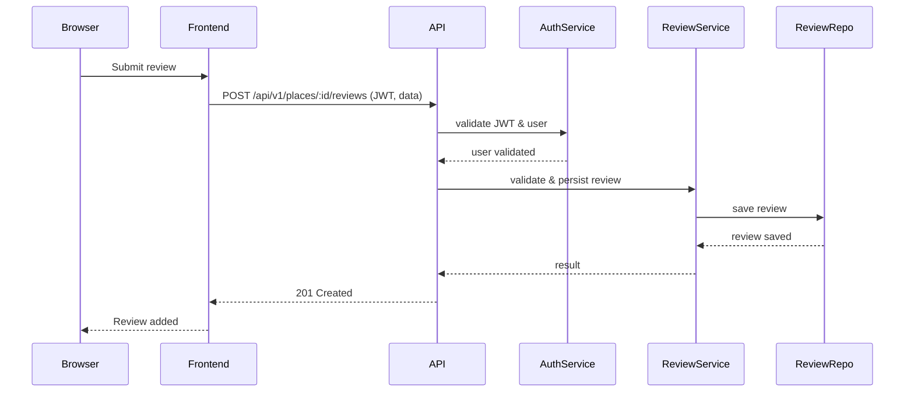
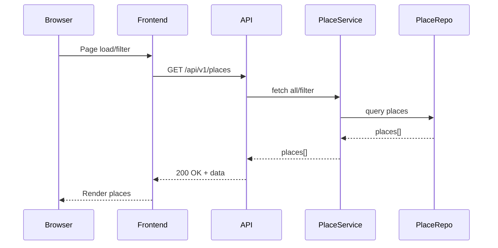

# HBnB Evolution – Technical Documentation

## Table of Contents

1. Project Introduction
2. High-Level Architecture and Package Diagram
3. Business Logic Layer – Class Diagram
4. Database ER Diagram
5. Sequence Diagrams for Core API Operations
6. Key Architectural Decisions and Design Patterns

---

## 1. Project Introduction

**HBnB Evolution** is a modern AirBnB clone developed using TypeScript, featuring a Vite (React) frontend and a Node.js backend using Express and a TypeORM ORM layer. The application enables managing users, places, amenities, and reviews, featuring multiple views and access control via JWT authentication and roles.

This document covers the architecture, relational structure, main operations, and core data/interaction flow. It serves as the baseline for complete system development.

---

## 2. High-Level Architecture – Package Diagram

### Diagram



### Notes

- **Presentation Layer:** Includes both backend Express REST controllers and Vite React web client.
- **Business Logic Layer:** Models business rules and domain logic through TypeScript services and classes.
- **Persistence Layer:** Handles all data storage via ORM, with entities and repository operations.

**Layer communication** is performed through well-defined interfaces (facade and repository pattern), promoting code decoupling and testability.

---

## 3. Business Logic Layer – Class Diagram



### Notes

- All entities inherit from `BaseEntity` (UUID and timestamps).
- One-to-many: User->Place, User->Review, Place->Review.
- Many-to-many: Place<->Amenity.
- Methods (such as password validation) are defined at the class level.

---

## 4. Database ER Diagram

```mermaid
erDiagram
    USERS {
      UUID id PK
      string first_name
      string last_name
      string email UNIQUE
      string password
      boolean is_admin
      datetime created_at
      datetime updated_at
    }
    PLACES {
      UUID id PK
      string title
      string description
      double price
      double latitude
      double longitude
      UUID owner_id FK
      datetime created_at
      datetime updated_at
    }
    REVIEWS {
      UUID id PK
      integer rating
      string comment
      UUID place_id FK
      UUID user_id FK
      datetime created_at
      datetime updated_at
    }
    AMENITIES {
      UUID id PK
      string name
      string description
      datetime created_at
      datetime updated_at
    }
    PLACE_AMENITIES {
      UUID place_id FK
      UUID amenity_id FK
    }

    USERS ||--o{ PLACES : "owns"
    USERS ||--o{ REVIEWS : "writes"
    PLACES ||--o{ REVIEWS : "has"
    PLACES ||--o{ PLACE_AMENITIES : ""
    AMENITIES ||--o{ PLACE_AMENITIES : ""
```

### Notes

- The schema supports all necessary relations: reviews and places linked to users, many-to-many for amenities via a join table.
- All primary keys are UUID v4, and timestamps are required for auditing.

---

## 5. Sequence Diagrams for Core API Operations

### a) User Registration



### b) Place Creation



### c) Review Submission



### d) List Places



---

## 6. Key Decisions and Best Practices

- **TypeScript stack** ensures robust types and maintainability.
- **Layered separation** using patterns (Facade/Repository) for decoupling and testability.
- **TypeORM ORM** gives robust persistence and easy engine migration (SQLite to MySQL).
- **JWT auth & role system**: clearly separates admin vs. user accesses.
- **Strict validation & error handling** both server and client side.
- **Frontend (Vite + React):** Modern, modular SPA with direct Fetch/JWT backend integration.
- **CORS & security:** Proper origin setup and secure token management.

---

This documentation is the canonical blueprint for development. All deliverables and code structure must reference and comply with this architecture.